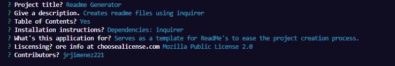

# ReadMe Generator
## Description
Creates readme files  

## Table of Contents
* [Installation](#installation)
* [Usage](#usage)
* [License](#license)
* [Contributors](#contributors)        
        

## Installation
Requirements: Inquirer

## Usage
Serves as a template for creating README files. 

## Liscencing: The Unlicense  
More info at [choosealicense.com](https://www.choosealicense.com)

## Contributors
jrjimenez221

### notes
Needs to be more fleshed out for sure. Since I'll use this later I'll modify the liscensing prompt to provide a direct link to the chosen liscense for more info and a description of what that liscense allows in the readme (More for myself than anything). It seems more complicated than it's worth but maybe also allow the user to type in their own table of contents or have it generated based on provided info (such as if they type in a video link section it'll appear on the tableofcontents or if the provided installation prompt is null it'll remove it from the table). Of course they can modify it themselves so it may not be worth the effort but it would be usefull to know how to do such a thing. 